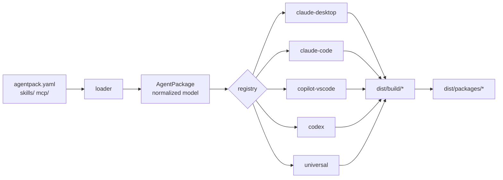

# Architecture

**Contents:** [Pipeline](#pipeline) · [Layers](#layers) · [Determinism](#determinism) ·
[Security](#security) · [Extending](#extending)

## Pipeline

```text
1. discover project (agentpack.yaml, searched upwards)
2. load manifest                → core/loader.py
3. load skills (SKILL.md + frontmatter contract)
4. load MCP definitions
5. load prompts / agents / commands / hooks / assets
6. normalize into AgentPackage  → models/package.py
7. semantic validation          → core/validator.py
8. resolve adapters             → core/registry.py
9. target compatibility check   (capability matrix + adapter.validate)
10. build each target in a temp dir
11. move successful output into dist/build/<target>/
12. optional archives into dist/packages/
13. write dist/agentpack-build.json
```



## Layers

| Layer | Module | Rule |
|---|---|---|
| Source | `core/loader.py` | Only place that touches the project tree |
| Model | `models/package.py` | Pure data; no I/O, no target knowledge |
| Validation | `core/validator.py` | Emits diagnostics, never mutates the model |
| Adapters | `adapters/*` | One module per target; no cross-imports except shared dialects |
| Build | `core/builder.py` | Staging, atomic promotion, manifest, hashing |

Core build logic contains **no** `if target == ...` branches. Adding a client
means adding an adapter module and one registry entry.

## Determinism

- File lists are sorted with POSIX separators.
- ZIP entries use a fixed timestamp (1980-01-01) and fixed permissions.
- `dist/agentpack-build.json` records a SHA-256 per target directory, so CI can
  assert that a rebuild produces identical output.

## Security

AgentPack treats the source repository as untrusted:

- nothing is ever executed — no skill scripts, no MCP commands, no hooks;
- symlinks are refused rather than followed;
- every source path is checked to stay inside the project root (`AP1006`);
- output is only ever written inside the configured output directory;
- secret values are rejected at load time if a manifest tries to inline them;
- the local environment is never read for secret material.

## Extending

Third-party adapters register through the `agentpack.targets` entry-point group:

```toml
[project.entry-points."agentpack.targets"]
my-client = "agentpack_adapter_myclient:MyClientAdapter"
```

The registry loads built-ins lazily and external adapters on demand, so a broken
plugin cannot break the CLI.
